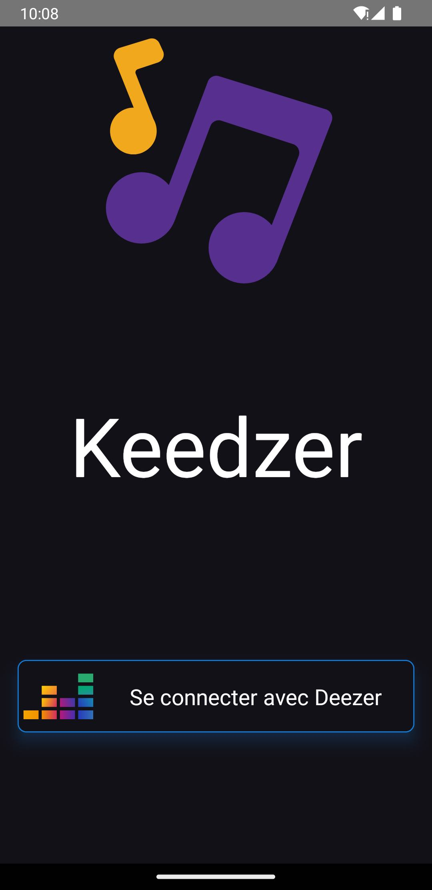
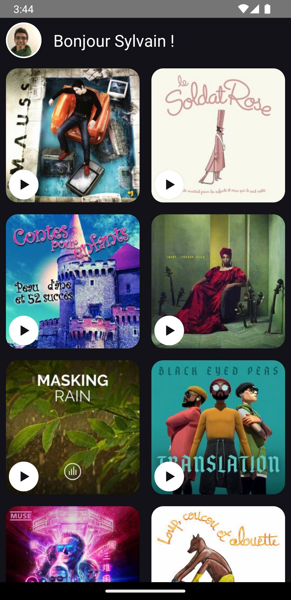
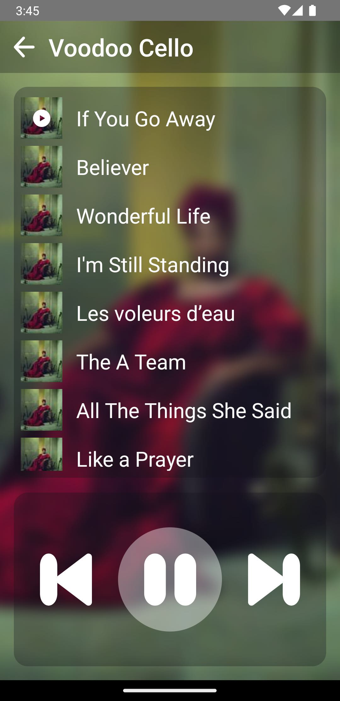

# Keedzer 

Keedzer est un concept d'application Deezer. Son interface et ses fonctionnalités sont volontairement simplifiées afin de favoriser son utilisation par des enfants.

Librairies et pratiques notables: 

- 👅 : React Native / Typescript
- 👷‍ : Clean Architecture
- 🎶 : [React Native Track Player](https://github.com/doublesymmetry/react-native-track-player)
- 🤹‍ : Jest
- 🔩 : Redux Toolkit

L'API Deezer ne permet pas la lecture des titres dans leur intégralité, c'est pourquoi les fonctionnalités ne sont pas complètes : 
- récupération des playlists
- lecture en background
- stockage du token d'authentification
- et bien d'autres encore 😃

| Écran d'authentification | Liste des albums | Player |
|--|--|--|
|  |  | 

